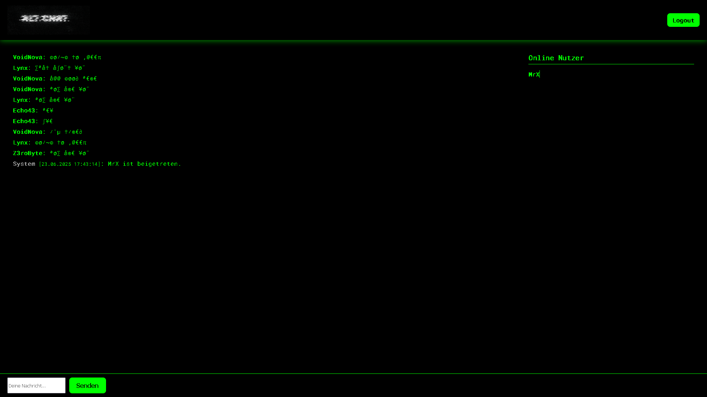
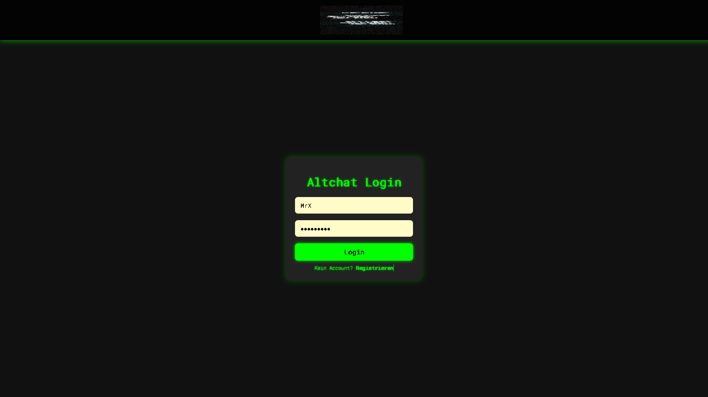
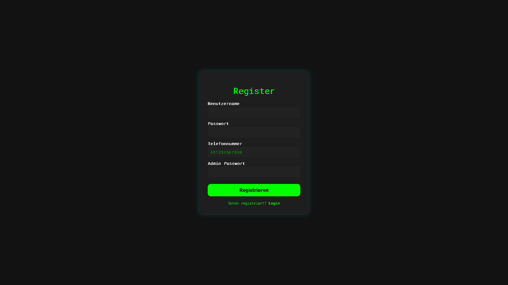
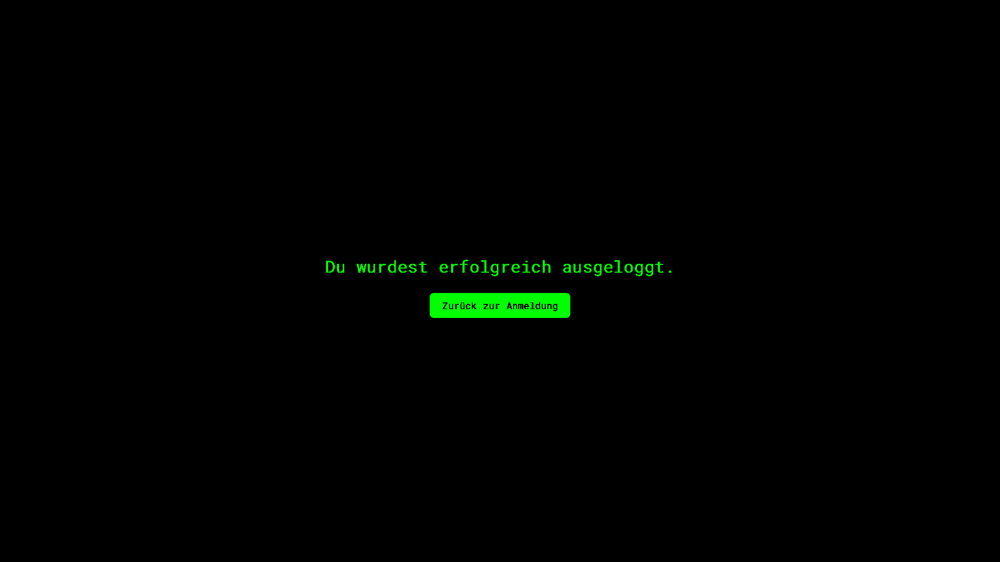

<h1 align="center">🟢 ALTCHAT v1.0.0-Final</h1>
<p align="center">
  
  
  
</p>

> 💬 ALTCHAT is a private web chat with dark mode, alt-language encoding and real-time messaging – made with Flask and Socket.IO.

---

## 🌌 Features

- 🔐 Login & registration with manual admin approval
- ✍️ Real-time chat with custom **Alt-Language conversion**
- 🟢 Online user list with unique name colors
- 💾 Message saving with timestamp and date
- 🎨 Darkmode UI (Roboto Mono, neon green style)
- ☠️ Full cache-busting for static assets

---

## 🚀 Local Installation

```bash
git clone https://github.com/mrgloeckchen/altchat.git
cd altchat
pip install -r requirements.txt
python app.py
```

> 🧠 By default, the server runs at `http://localhost:5000`

---

## 🛠️ Project Structure

```
altchat/
│
├── app.py              # Flask + Socket.IO backend
├── users.db            # SQLite database
│
├── static/             # CSS / JS / Fonts / Icons
├── templates/          # HTML templates (chat, login, register)
└── requirements.txt    # Python dependencies
```

---

## 📲 WhatsApp Notification Bot (optional)

This project originally included a WhatsApp notification system for offline users.

If you want to build your own bot:

> ⚙️ You need to create it manually using [Baileys](https://baileys.wiki/docs/intro/), a Node.js WhatsApp Web API.

Basic idea:
- Local server receives a POST request when a user goes offline
- Your bot reads the phone number from the database
- Sends a WhatsApp message via Baileys

**Note:**  
The WhatsApp bot is not included in this repository. You'll need to write and host it yourself.

---

## 📸 Screenshots

### 💬 Chat View


### 🔐 Login Page


### 📝 Register Page


### 🔚 Logout Confirmation


---

## 📜 License

MIT License © 2025 [@mrgloeckchen](https://github.com/mrgloeckchen)

---

## 💚 Support

If you like this project, give it a ⭐ on GitHub or hit me up on:  
📲 TikTok / Instagram → **@mrgloeckchen**

---
